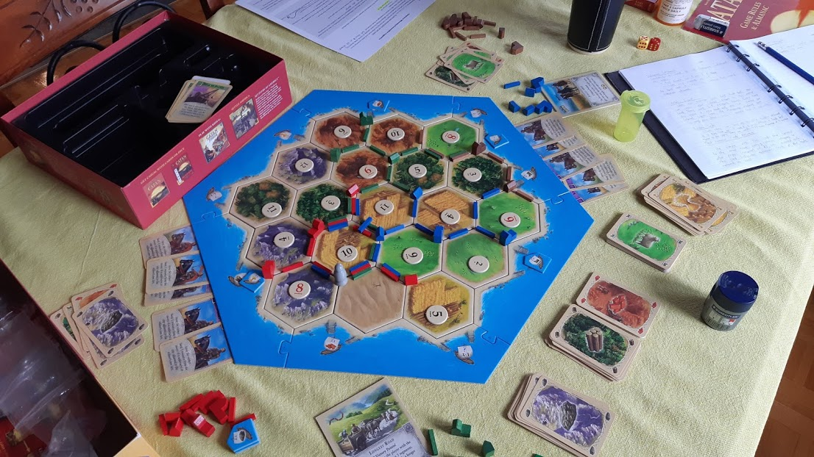
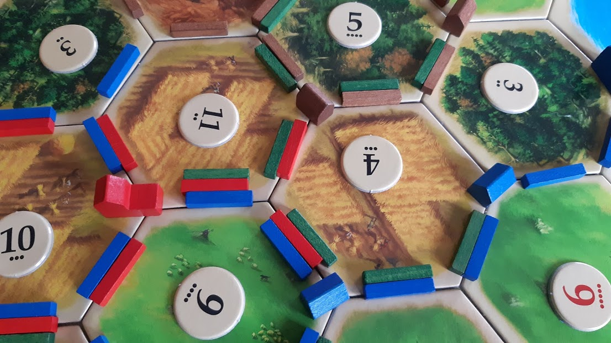
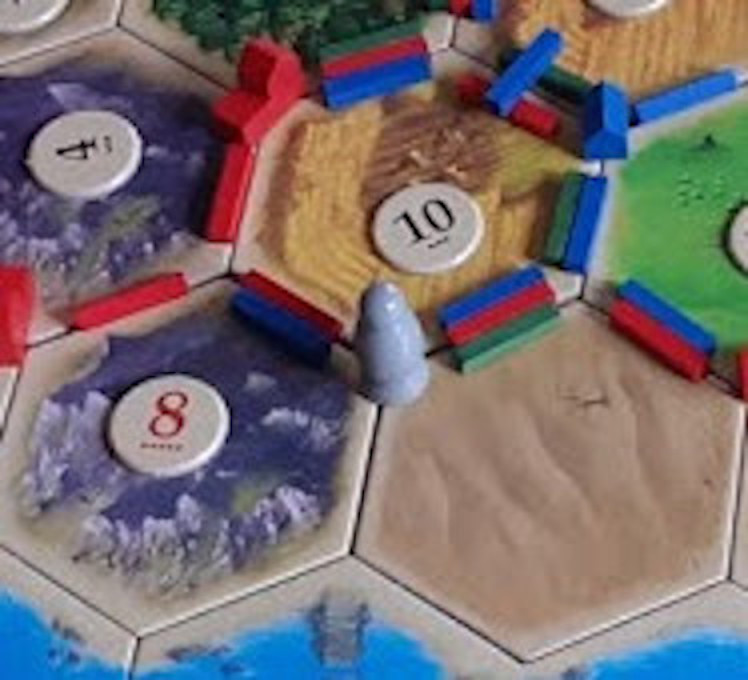
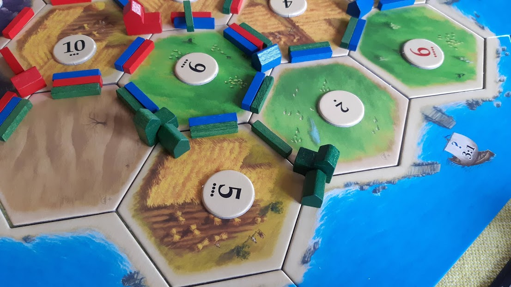
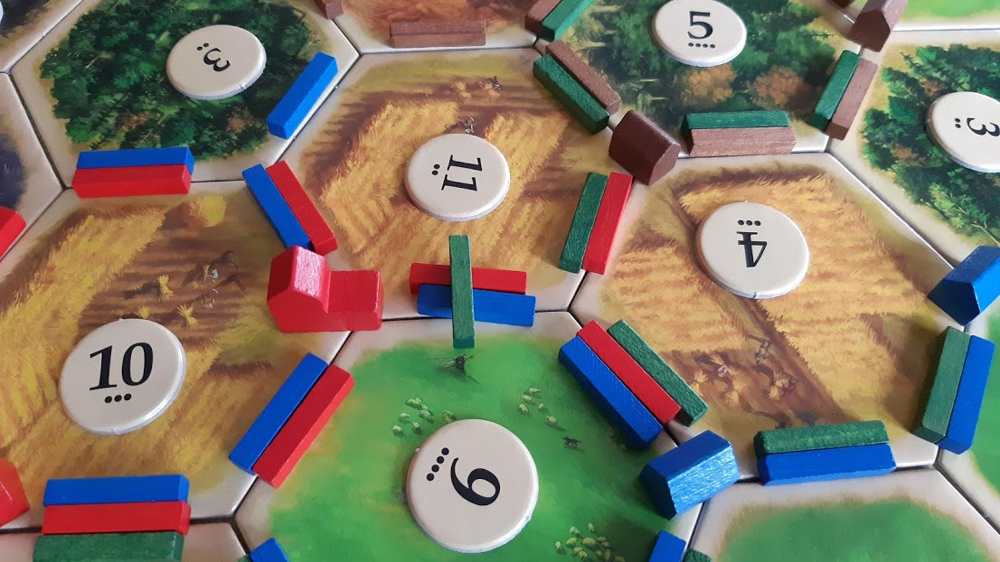

# Catan Colonization Mod

---

Mod for the Settlers of Catan boardgame. All you need to play is the base Catan boardgame, nothing else is required. This mod is compatible with the 5/6 player expansion as well.

Unless specified in this rulesheet, all rules in the original Catan game still apply.

## Scenario

The empires of the world have discovered a new prosperous land. With the hope of bringing new riches to their empires, they send settlers to establish new profitable colonies.

## Termonology Changes

| Original Term | New Term |
| ------------- | -------- |
| Settlement    | Trade Post |
| City | Colony |
| Robber | No longer exists. Token becomes the Native Settlement |
| Progress Cards (Monopoly, Year of Plenty, Road Building development cards) | Colonization Packages |
| Harbour Marker | Primary Export |
| Longest Road | Most Extensive Trade Network
| Victory Point Cards (Library, Great Hall, etc. development cards) | Specialty Building Cards |

## Rule Changes

- Buying development cards now just means buying knights
- Harbours printed on the game board are ignored
- Multiple roads can be placed between intersections (see image)

- To trade with a player, you must have a road connected to one of their trade posts or colonies
- If you run out of roads, you can remove old ones to use when buying a new one
- There is no more robber, but rolling a 7 still requires players to follow the discard rule, except it only applies to players with more than 12 cards in their hand

## Game Setup

- Separate 3 types of development cards
- Randomly place the Native Settlement at a hex intersection around the desert tile (pick one at random if you are using the expansion). Use a dice roll to pick which of the 6 intersections around the desert tile to place the Native Settlement on (see image).

## Game Start

Roll to see who starts. Going clockwise, players each place 1 colony and 1 road. The starting colony must be placed on the outer edge of the map, next to the water. Players cannot place their colony next to a desert unless there is another tile adjacent to the colony. Once the last player is reached, players pick 1 colonization package of their choice from those available and place 1 additional road, going counter-clockwise, starting with the last player.

Once all setup, all players should have:

- 1 colony
- 2 roads
- 1 colonization package

Give each player 2 resource cards corresponding to the tiles next to their colony. If there is only one tile next to the colony, give the player 2 of that resIf the player settled next to a desert, give themource card.

---

## Rules

### Imperial Stimulus

To aid struggling colonies, once all players, except for 2, have built their first trade post, the 2 who have not yet built their trade post will each receive 1 of the remaining Colonization Packages. If playing with the 5/6 player expansion, do the same except with the remaining 3 players, instead of just 2. 

### Native Settlement

Connecting a road to a Native Settlement lets you:

- Buy knights for 1 ore and 1 sheep
- Trade any resource at 3:1

### Colonial Export

When you establish your first trade post, you can select one of the available Colonial Exports to the empire. Every time you build a new trade post, you can change your Colonial Export from the remaining available ones. You may also chose one of the 3:1 generic trades, if you want.

### Specialty Building Cards

Each colony can have 1 specialty building attached to it. Buy them for 2 wood and 3 brick. When a player buys one, they can pick which specialty building card they want and attach a Trade Post marker to the colony (see image). They are worth 1 VP each. Maximum of 5 available.

### Most Extensive Trade Network

The player whose roads connect to the most trade posts and colonies belonging to other players, with a minimum of 2, gets awarded with this card. The Native Settlement counts in the trade network as well.

### Blockade

At the end of their turn, players can attempt to create a blockade with a road they own, meaning other players cannot trade with other players or the Native Settlement, unless they are connected by a different road.

#### Blockade Battles

The player trying to create the blockade is the "attacker". The other players with roads there are the "defenders". The defending player with the largest army (most knights) will battle with the attacker. The attacker and defender do one dice roll for each knight they have, plus 1 extra dice roll for the defender. Sum the dice roles for each. Whoever has the highest count wins. Attacker wins ties. If the attacker wins, a blockade is placed (see image) and the attacker loses 1 knight. If the defender wins, nothing happens.

Players can attack a blockade on their road at the end of their turn by entering a blockade battle. Same rules as when attempting to make a blockade, except the player defending the blockade wins ties and the player attacking the blockade gets an extra dice role. If the attacker wins, the blockade is removed and the blockading road is placed back to the way it originally was. If the blockade owner wins, the blockade stays. Players can offer to remove blockades as part of a trade. Blockade owners may even charge players tarifs to allow trade to continue.

#### Blockades and Trade Networks

Since blockades prevent trades, it only makes sense that it should affect the Most Extensive Trade Network. Once a blockade is placed, trade networks should be recalculated to determine if another player should now receive this card.
